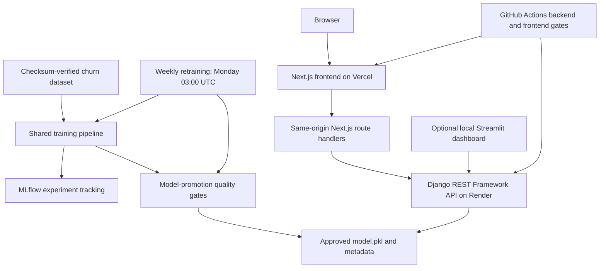

# Telecom Customer Churn MLOps

This repository is an end-to-end, beginner-friendly Telecom Customer Churn
MLOps project. It downloads and validates the IBM sample dataset, trains and
compares reproducible scikit-learn pipelines, tracks experiments with MLflow,
serves the approved model through Django REST Framework, and provides a
production Next.js interface plus an optional local Streamlit dashboard.
Automated tests, a real ROC-AUC quality gate, Docker, GitHub Actions CI,
guarded weekly retraining, and deployment manifests complete the delivery
workflow.

The repository contains deployment configuration, but it does not claim a live
API or frontend. Add public links only after deploying and verifying both
services.

## Technology stack

- Python 3.11 and uv for the runtime and dependency management
- Django and Django REST Framework for the API
- drf-spectacular for OpenAPI schema generation and Swagger UI
- pandas, scikit-learn, and joblib for preprocessing, training, and persistence
- MLflow for local experiment tracking and model artifacts
- Next.js 16, React 19, TypeScript, and Tailwind CSS for the Vercel frontend
- Streamlit for the optional local customer churn dashboard
- requests for HTTP clients
- Psycopg for future PostgreSQL connectivity
- Gunicorn for production serving on supported platforms
- pytest, pytest-django, and pytest-cov for tests and coverage
- Ruff for linting and formatting
- Docker for the production-oriented API image and local Compose workflow
- GitHub Actions for CI, model-quality checks, and weekly retraining
- Render Blueprint configuration for the Docker-based Django API
- Vercel configuration for the Next.js frontend and server-side API proxy

## Architecture



CI verifies code quality, Django configuration, the complete test suite, model
quality, coverage, and the Docker build. Weekly retraining writes an isolated
candidate, applies promotion policy, retests the approved candidate, and only
then permits the model and metadata pair to replace the tracked artifacts.

## Project structure

```text
.
|-- .github/workflows/
|   |-- ci.yml                    # tests, quality gate, coverage, image build
|   `-- retrain.yml               # weekly candidate training and promotion
|-- .streamlit/                   # safe local Streamlit configuration
|-- config/                       # Django settings, URL routing, WSGI/ASGI
|-- dashboard/                    # Streamlit app, components, and API client
|-- data/                         # downloaded real dataset (ignored)
|-- frontend/                     # Next.js UI and same-origin API proxy
|-- ml_pipeline/                  # data, preprocessing, training, promotion
|-- models/                       # approved model.pkl and metadata
|-- predictions/                  # serializers, services, API views, URLs
|-- tests/                        # unit, integration, and quality-gate tests
|-- Dockerfile                    # production-oriented Django API image
|-- compose.yaml                  # local container execution
|-- render.yaml                   # Render Docker service Blueprint
|-- pyproject.toml                # dependencies and tool configuration
`-- uv.lock                       # reproducible dependency lock
```

## Installation with uv

Install
[uv](https://docs.astral.sh/uv/getting-started/installation/) if it is not
already available. From the project directory, let uv install the pinned Python
version and all locked dependencies:

```bash
uv python install 3.11
uv sync
```

Create a local environment file from the safe example and replace the example
secret before using production-like settings:

```powershell
Copy-Item .env.example .env
```

On macOS or Linux, use `cp .env.example .env` instead. The real `.env` file is
ignored by Git and must never be committed.

## Dependency synchronization

Run this command after switching branches or whenever `pyproject.toml` or
`uv.lock` changes:

```bash
uv sync
```

Use `uv add <package>` for an API runtime dependency,
`uv add --group training <package>` for a training-only dependency,
`uv add --group dashboard <package>` for a local dashboard dependency, and
`uv add --dev <package>` for a development dependency. The configured default
groups make a normal `uv sync` install all three local toolsets. Commit both
`pyproject.toml` and `uv.lock` when dependencies change.

## Dataset

The project uses the public
[IBM Telco Customer Churn dataset](https://github.com/IBM/telco-customer-churn-on-icp4d).
It contains 7,043 fictional telecom customers and 21 columns. `Churn` is the
Yes/No target. After removing `customerID` and the target, 19 model features
remain.

Download the pinned and checksum-verified CSV to `data/telco_churn.csv`:

```bash
uv run python manage.py download_churn_data
```

The command validates all required columns and will not silently replace an
existing dataset. To intentionally download it again, use:

```bash
uv run python manage.py download_churn_data --overwrite
```

Downloaded data is local and ignored by Git. Fast tests use a tracked fixture
and mock HTTP requests, so they do not require network access. The full test
suite deliberately fails with a setup instruction if this real CSV is absent,
because the model-quality test is a required gate rather than an optional skip.

## Train churn models

Download the dataset first, then train and compare all configured models:

```bash
uv run python manage.py train_churn_model
```

Training performs one stratified 80/20 split with `random_state=42`. It compares
balanced logistic regression and balanced random forest classifiers. Each
candidate is one complete scikit-learn pipeline containing `TotalCharges`
cleaning, automatic numerical/categorical preprocessing, scaling, one-hot
encoding, and the classifier. Saving the whole pipeline keeps training and
future API inference transformations consistent.

The winning pipeline and its calculated metadata are written to:

```text
models/model.pkl
models/model_metadata.json
```

The currently approved files are tracked so a clean Docker or Render build has
the exact model it needs. Local MLflow state and temporary candidates under
`artifacts/` remain ignored. Only load joblib model files produced by this
trusted training and promotion workflow; Python pickle-compatible formats must
never be loaded from an untrusted source.

### Class imbalance and metrics

Only about 26.5% of the customers in this dataset churn. Both classifiers use
balanced class weights so mistakes on the smaller churn class receive more
importance during fitting.

Every model is evaluated with:

- **ROC-AUC**, which measures ranking quality across classification thresholds
  and is the model-selection metric;
- **PR-AUC** (average precision), which emphasizes precision and recall for the
  minority churn class and is especially informative for imbalanced data;
- **F1**, which summarizes the balance between precision and recall at the
  classifier's decision threshold.

Accuracy is not used as the main selection metric because an imbalanced model
can appear accurate simply by favoring the majority non-churn class.

## MLflow

Training creates or reuses a local experiment named `telecom-churn`. It creates
one clearly named run per candidate and logs parameters, ROC-AUC, PR-AUC, F1,
and the complete fitted pipeline. MLflow uses a project-local SQLite database
and local artifact directory; no external or paid tracking server is required.

Start the local MLflow interface from the project root:

```bash
uv run mlflow ui
```

Open `http://127.0.0.1:5000` to compare runs and inspect artifacts. Local MLflow
database and artifact files are ignored by Git.

## Database migrations

Apply the built-in Django migrations to the local SQLite database:

```bash
uv run python manage.py migrate
```

When a future model change needs a migration, create and apply it with:

```bash
uv run python manage.py makemigrations
uv run python manage.py migrate
```

## Run Django locally

Check the configuration, apply migrations, and start the development server:

```bash
uv run python manage.py check
uv run python manage.py migrate
uv run python manage.py runserver
```

The API is then available at `http://127.0.0.1:8000/api/`.

The saved model and metadata must exist at `models/model.pkl` and
`models/model_metadata.json` for predictions. Train the model first if those
local artifacts are not present.

## API endpoints

| Method | Route | Purpose |
| --- | --- | --- |
| `GET` | `/api/health/` | Process and model-readiness health check |
| `POST` | `/api/predict/` | Validate one customer and predict churn risk |
| `GET` | `/api/schema/` | Generated OpenAPI schema |
| `GET` | `/api/docs/` | Interactive Swagger UI |

## Prediction endpoint

Send one customer's 19 raw features to `POST /api/predict/`. The API validates
the request, then passes it directly to the cached, complete scikit-learn
pipeline. It does not recreate the training preprocessing.

Example request body:

```json
{
  "gender": "Female",
  "SeniorCitizen": 0,
  "Partner": "Yes",
  "Dependents": "No",
  "tenure": 5,
  "PhoneService": "Yes",
  "MultipleLines": "No",
  "InternetService": "Fiber optic",
  "OnlineSecurity": "No",
  "OnlineBackup": "No",
  "DeviceProtection": "No",
  "TechSupport": "No",
  "StreamingTV": "Yes",
  "StreamingMovies": "Yes",
  "Contract": "Month-to-month",
  "PaperlessBilling": "Yes",
  "PaymentMethod": "Electronic check",
  "MonthlyCharges": 89.9,
  "TotalCharges": 450.5
}
```

With the current locally trained artifact, an example HTTP 200 response is:

```json
{
  "churn_probability": 0.899,
  "will_churn": true,
  "risk": "high",
  "model_version": "1.0.0"
}
```

Probabilities are rounded to four decimal places. `will_churn` uses a `0.5`
threshold. Risk is `low` below `0.35`, `medium` from `0.35` to below `0.65`,
and `high` from `0.65` upward.

Validation problems return HTTP 400 with standard field-based Django REST
Framework errors. For example:

```json
{
  "tenure": [
    "Ensure this value is greater than or equal to 0."
  ]
}
```

If the model or metadata cannot be loaded, prediction returns HTTP 503 without
exposing internal exception details or local paths:

```json
{
  "detail": "Prediction model is not available."
}
```

Call the endpoint with curl from macOS or Linux:

```bash
curl -X POST http://127.0.0.1:8000/api/predict/ \
  -H "Content-Type: application/json" \
  -d '{
    "gender": "Female",
    "SeniorCitizen": 0,
    "Partner": "Yes",
    "Dependents": "No",
    "tenure": 5,
    "PhoneService": "Yes",
    "MultipleLines": "No",
    "InternetService": "Fiber optic",
    "OnlineSecurity": "No",
    "OnlineBackup": "No",
    "DeviceProtection": "No",
    "TechSupport": "No",
    "StreamingTV": "Yes",
    "StreamingMovies": "Yes",
    "Contract": "Month-to-month",
    "PaperlessBilling": "Yes",
    "PaymentMethod": "Electronic check",
    "MonthlyCharges": 89.9,
    "TotalCharges": 450.5
  }'
```

PowerShell users can use `curl.exe` with equivalent quoting or
`Invoke-RestMethod`.

## API documentation

With Django running, interactive Swagger documentation is available at
`http://127.0.0.1:8000/api/docs/`. The generated OpenAPI schema is available at
`http://127.0.0.1:8000/api/schema/`.

## Next.js frontend

The deployable browser interface lives in `frontend/`. It contains all 19
model fields, accessible validation and readiness states, responsive layouts,
and low/medium/high prediction results. The browser calls only same-origin
`/api/health` and `/api/predict` routes. Those Next.js Route Handlers read the
server-only `RENDER_API_URL`, apply a 10-second upstream timeout, disable
caching, sanitize failures, and forward requests to Django.

Start Django first, then prepare the frontend in another terminal:

```powershell
Set-Location frontend
Copy-Item .env.example .env.local
npm install
npm run dev
```

On macOS or Linux, replace `Copy-Item` with
`cp .env.example .env.local`. The example config points to the local Django
server:

```dotenv
RENDER_API_URL=http://127.0.0.1:8000
```

Open `http://localhost:3000`. Do not rename this variable with a
`NEXT_PUBLIC_` prefix: the backend origin belongs only in the Next.js server
runtime and must not be embedded in browser JavaScript.

Run the complete frontend gate with:

```bash
cd frontend
npm run lint
npm run test
npm run typecheck
npm run build
```

## Optional local Streamlit dashboard

The dashboard at `dashboard/app.py` remains available for local exploration.
It provides a guided form for all 19 customer
features, displays prediction results, and reports API/model readiness. It is a
presentation client: it sends HTTP requests to Django and never imports or
loads `models/model.pkl` itself. Django remains responsible for validation,
preprocessing, and inference.

The dashboard reads the Django base URL from `API_URL` and defaults to
`http://127.0.0.1:8000`. You can set it in the ignored local `.env` file:

```dotenv
API_URL=http://127.0.0.1:8000
```

Use only the base URL; the dashboard safely adds `/api/health/` and
`/api/predict/`. Do not include either endpoint path in `API_URL`.

Run Django in the first terminal:

```bash
uv run python manage.py runserver
```

Run Streamlit from the project root in a second terminal:

```bash
uv run streamlit run dashboard/app.py
```

The normal local URLs are:

- Django API: `http://127.0.0.1:8000/api/`
- Streamlit dashboard: `http://127.0.0.1:8501`

The expected workflow is:

1. The cached sidebar health check confirms that Django is reachable and the
   prediction model is loaded.
2. A user completes the customer form and selects **Predict churn risk**.
3. Streamlit sends one JSON request to `POST /api/predict/`.
4. The dashboard displays the probability, Boolean threshold result, risk
   level, neutral interpretation, and model version returned by Django.

If the dashboard reports a connection error, confirm that Django is running,
that `API_URL` uses the correct host and port, and that
`http://127.0.0.1:8000/api/health/` is reachable. An HTTP 503 health response
means Django is reachable but the local model or metadata is unavailable; run
the training command or restore the approved tracked artifacts. The dashboard
stays available during these failures and shows a safe error instead of a
Python traceback.

## Run tests

Tests are separated by responsibility:

```text
tests/
├── fixtures/sample_churn.csv
├── conftest.py
├── test_dashboard_api_client.py
├── test_dashboard_components.py
├── test_data_download.py
├── test_data_pipeline.py
├── test_health.py
├── test_model_loader.py
├── test_model_promotion.py
├── test_model_quality.py
├── test_openapi.py
├── test_prediction_api.py
└── test_training.py
```

The deterministic sample CSV has the complete production schema, both churn
classes, blank and invalid `TotalCharges` values, all contract types, and the
phone/internet special values used by the real dataset. Temporary artifact
fixtures keep tests from overwriting `models/`.

Run the fast, network-independent suite without the real-data quality gate:

```bash
uv run pytest -m "not model_quality"
```

Download the real dataset and run every test, including the quality gate:

```bash
uv run python manage.py download_churn_data
uv run pytest -v
```

The `model_quality` test uses the shared preprocessing pipeline, a stratified
80/20 split, the configured Logistic Regression baseline, and
`random_state=42`. It requires ROC-AUC to be strictly greater than `0.78`; a
regression reports the measured score in the failure message. The normal
`uv run pytest` command includes this gate.

Run tests with missing-line coverage and the configured 75% starting floor:

```bash
uv run pytest --cov=. --cov-report=term-missing
```

Coverage omits migrations, generated server entry points, test code, and the
Streamlit page-composition entry point. Business logic in the data pipeline,
training services, prediction API, model loader, and dashboard client remains
included.

## Run Ruff

Check for lint problems and confirm that files are formatted:

```bash
uv run ruff check .
uv run ruff format --check .
```

To format Python files automatically, run:

```bash
uv run ruff format .
```

## Health endpoint

With the development server running, request the health endpoint:

```bash
curl http://127.0.0.1:8000/api/health/
```

PowerShell users can run `curl.exe` explicitly. A ready HTTP 200 response is:

```json
{
  "status": "ok",
  "service": "churn-prediction-api",
  "model_loaded": true,
  "model_version": "1.0.0"
}
```

If the model or metadata is unavailable, the endpoint remains responsive and
returns HTTP 503 with readiness information:

```json
{
  "status": "degraded",
  "service": "churn-prediction-api",
  "model_loaded": false,
  "model_version": null
}
```

HTTP 503 is used consistently for the degraded response because this endpoint
acts as a readiness check: the web process is reachable, but it is not ready to
serve predictions. The endpoint accepts `GET` requests. Other methods,
including `POST`, return HTTP 405 Method Not Allowed.

## Run the Django API with Docker

The multi-stage image uses Python 3.11 slim and pinned `uv`, installs only the
locked API runtime dependencies with
`uv sync --frozen --no-default-groups`, copies only the Django API code and
required model artifacts, collects compressed static files, and runs both
Django and model-bundle checks during the build. MLflow, Streamlit, and their
local-only dependency trees are deliberately absent from the public inference
image. The final stage serves through Gunicorn as an unprivileged user with a
120-second worker timeout. Its health check uses Python's standard library, so
no extra curl package is needed.

The approved model and metadata are tracked and included in the Docker build
context, so a clean checkout can build reproducibly. To intentionally recreate
the local artifacts before a build, run:

```bash
uv run python manage.py download_churn_data
uv run python manage.py train_churn_model
```

Build the image:

```bash
docker build -t churn-api .
```

Run it directly on port 8000:

```bash
docker run --rm -p 8000:8000 \
  -e DJANGO_SECRET_KEY=local-development-secret \
  -e DJANGO_DEBUG=false \
  -e DJANGO_ALLOWED_HOSTS=localhost,127.0.0.1 \
  -e MODEL_PATH=/app/models/model.pkl \
  -e MODEL_METADATA_PATH=/app/models/model_metadata.json \
  -e PORT=8000 \
  churn-api
```

Or build and start the same API through Compose, with no host volumes that can
overwrite the bundled artifacts:

```bash
docker compose up --build
```

## Environment variables

Copy `.env.example` for local development. Hosting platforms should configure
the same values in their environment or secrets UI; do not commit a real
`.env` or `.streamlit/secrets.toml`.

| Variable | Used by | Purpose and default |
| --- | --- | --- |
| `DJANGO_SECRET_KEY` | Django | Signing secret; unsafe local fallback, always set in production |
| `DJANGO_DEBUG` | Django | Debug mode; `True` locally and `false` in the image/Render |
| `DJANGO_ALLOWED_HOSTS` | Django | Comma-separated hosts; defaults to `localhost,127.0.0.1` |
| `RENDER_EXTERNAL_HOSTNAME` | Django/Render | Exact Render hostname, supplied automatically by Render and appended to allowed hosts |
| `MODEL_PATH` | Django | Pipeline path; defaults to `models/model.pkl` |
| `MODEL_METADATA_PATH` | Django | Metadata path; defaults to `models/model_metadata.json` |
| `PORT` | Gunicorn | Listening port; defaults to `8000`, provided by Render |
| `WEB_CONCURRENCY` | Gunicorn | Worker count; defaults to `2` |
| `RENDER_API_URL` | Next.js/Vercel | Server-only Django base URL, with no endpoint suffix |
| `API_URL` | Local Streamlit | Django base URL; defaults to `http://127.0.0.1:8000` |
| `MLFLOW_TRACKING_URI` | Training | Optional tracking store; defaults to local `mlflow.db` |
| `RENDER_DEPLOY_HOOK_URL` | GitHub Actions secret | Optional Render deploy hook used only after a promoted model commit |

Once the container is ready, verify its three public surfaces:

```bash
curl http://127.0.0.1:8000/api/health/
curl http://127.0.0.1:8000/api/docs/
```

Use the complete prediction curl request in the Prediction endpoint section to
verify `POST /api/predict/` against the container.

Common Docker troubleshooting:

- If the build reports missing `models/model.pkl` or metadata, run the download
  and training commands above before rebuilding.
- If `/api/health/` returns HTTP 503, confirm both model paths are correct and
  that the two artifacts were produced by the current project dependencies.
- If Django reports an invalid host, add the hostname used by the request to
  the comma-separated `DJANGO_ALLOWED_HOSTS` value. Keep `127.0.0.1` for the
  built-in container health check.
- If port 8000 is already in use, publish a different host port, for example
  `-p 8080:8000`, and call the API on port 8080.
- If Docker cannot connect to its engine, start Docker Desktop or the local
  Docker daemon before running build or Compose commands.

## GitHub Actions CI

`.github/workflows/ci.yml` runs on pushes to `main`, pull requests targeting
`main`, and manual `workflow_dispatch` runs. It has read-only repository
permissions and safe CI-only environment values. Its independent Ubuntu jobs
cover the Python API and the Next.js frontend, allowing both stacks to fail
quickly while still reporting their own results.

The workflow fails as soon as any of these checks fails:

1. Python 3.11 and locked uv dependency synchronization with caching.
2. Ruff lint and format verification.
3. Checksum-verified dataset download with explicit `--overwrite` and a
   7,043-row/schema validation.
4. Django system, deployment, and migration checks.
5. The dedicated real-data model-quality gate.
6. The full pytest suite with terminal and XML coverage reports.
7. Validation that the tracked approved model bundle loads successfully.
8. A production Docker image build from the approved tracked artifacts.
9. Node 24 dependency installation with `npm ci`, followed by frontend lint,
   unit tests, TypeScript checking, and a production Next.js build.

The quality test is intentionally explicit even though it is also part of the
full pytest run: the separate step makes a model regression easy to identify in
the Actions UI. CI does not download an undocumented file or require a manual
dataset upload.

After this branch is merged into `main`, a maintainer can start a manual run
with:

```bash
gh workflow run ci.yml --ref main
```

No remote workflow run has been claimed as green in this repository state; the
workflow must be pushed and completed on GitHub before checking that item in
the submission checklist.

## Weekly model retraining

`.github/workflows/retrain.yml` runs every Monday at 03:00 UTC using
`0 3 * * 1`, and it also supports manual dispatch. It downloads and verifies
the pinned dataset, then trains to `artifacts/candidate/` so the current model
cannot be overwritten during training.

The workflow is split by privilege:

- the training job has read-only repository access;
- the promotion job alone has `contents: write`, and it runs only for a
  successful `main` workflow;
- the summary job is read-only.

The approved model and metadata are uploaded together for 90 days. Candidate
metadata is uploaded even when a later step fails and is retained for 30 days.
Local `mlruns/`, `mlartifacts/`, MLflow SQLite files, and temporary candidates
remain ignored.

The final job summary reads the generated `models/model_metadata.json` data and
reports model name, version, ROC-AUC, PR-AUC, F1, dataset row count, training
timestamp, job results, whether repository artifacts changed, and whether a
Render redeploy was requested. Metrics are never hardcoded in the workflow.

After the workflow is merged into `main`, start a manual retraining run with
care:

```bash
gh workflow run retrain.yml --ref main
```

On `main`, a changed approved pair is committed with the GitHub Actions bot
identity and message `chore: update weekly churn model`. An unchanged pair does
not create an empty commit. The retraining workflow has no push trigger, and
its repository push uses `GITHUB_TOKEN`; [GitHub suppresses new workflow runs
from that token by default](https://docs.github.com/en/actions/how-tos/write-workflows/choose-when-workflows-run/trigger-a-workflow#triggering-a-workflow-from-a-workflow).
Together these choices prevent an automation loop, while the retraining
workflow itself runs Django checks and all tests before the commit.

If the repository secret `RENDER_DEPLOY_HOOK_URL` is configured, the workflow
calls that masked hook only after the approved pair was actually committed.
There is no deployment call for a failed, rejected, or byte-identical
candidate. This closes the gap created by GitHub suppressing CI runs from the
workflow's own `GITHUB_TOKEN` commit, while avoiding duplicate deployments.

Repository rules must allow the workflow's bot to update `main`. If protected
branch policy requires every change to use a pull request, leave direct bot
pushes disabled and adapt the promotion job to open a reviewed model-update PR
instead.

## Model-promotion rules

Promotion policy lives in reusable Python code under
`ml_pipeline/services/promotion.py`; the workflow does not hide policy in a
large shell condition. A candidate is approved only when all of these are true:

1. Training completed and both candidate files are non-empty.
2. Metadata is complete, typed, finite, and internally valid.
3. The joblib artifact is a compatible full pipeline with `predict`,
   `predict_proba`, the expected stages, classes, and all 19 feature names.
4. Candidate ROC-AUC is strictly greater than `0.78`.
5. Candidate ROC-AUC is no more than `0.005` below the current approved score.
6. The approved bundle loads, Django checks pass, and every test passes against
   that bundle.

Missing or invalid current metadata blocks normal weekly promotion. Explicit
bootstrap mode exists for a deliberate first model, but the scheduled workflow
does not enable it. Approved files are copied as an immutable, checksum-checked
pair before the commit job sees them, so a failed candidate never replaces the
current model.

## Deploy the Django API to Render

`render.yaml` defines a [Render](https://render.com/docs/blueprint-spec) Docker
web service built from this repository's
`Dockerfile`. It uses the free plan by default, waits for linked CI checks to
pass before auto-deploying, starts Gunicorn through the image `CMD`, and checks
`/api/health/`. Render supplies `PORT`; the Blueprint deliberately does not
hardcode it. Django reads Render's exact `RENDER_EXTERNAL_HOSTNAME`
automatically, so the service never needs a wildcard allowed host.

Manual deployment steps:

1. Push the reviewed project to a GitHub repository and merge it into `main`.
2. In Render, choose **New > Blueprint** and connect that repository.
3. Select the root `render.yaml` and review the proposed web service.
4. Confirm that Render generated `DJANGO_SECRET_KEY`; never replace it with a
   literal committed value.
5. Keep `DJANGO_DEBUG=false`, the `/app/models/...` paths, and the safe
   loopback values already in `DJANGO_ALLOWED_HOSTS`. Render supplies its exact
   public hostname separately. Add any verified custom domain to
   `DJANGO_ALLOWED_HOSTS` later.
6. Deploy, wait for the linked CI checks and container health check, then copy
   the actual service base URL.
7. Verify health, documentation, and a complete prediction before publishing
   the URL.
8. Optionally create a Render deploy hook and save it as the masked GitHub
   Actions secret `RENDER_DEPLOY_HOOK_URL` so promoted weekly models are
   redeployed.

For example, after setting a real verified URL in a shell:

```bash
export RENDER_URL=https://your-actual-render-service.example
curl "$RENDER_URL/api/health/"
curl "$RENDER_URL/api/docs/"
```

Use the prediction payload from the Prediction endpoint section with
`$RENDER_URL/api/predict/` for the final POST check. No database or persistent
disk is required for inference. The API returns HTTP 503 to Render's health
check if the bundled model is absent or invalid, preventing an unready
deployment from being treated as healthy.

Render's Events and Logs pages show build, start, and health-check failures.
Use **Manual Deploy > Deploy latest commit** to retry a fixed revision. If a
new release is unhealthy, restore the previous healthy deployment from
Render's rollback controls and investigate before promoting it again.

## Deploy the Next.js frontend to Vercel

`frontend/` is an independent Next.js application. `frontend/vercel.json`
selects Next.js and makes `npm run verify`—lint, tests, type checking, and the
production build—the deployment build command. `package.json` and
`package-lock.json` are the frontend dependency sources of truth; the Python
lock files remain authoritative for Django and Streamlit.

Manual deployment steps:

1. Import the same GitHub repository into Vercel.
2. Set the project root directory to `frontend` and keep the detected Next.js
   framework preset.
3. Set `RENDER_API_URL` to the verified HTTPS Render base URL in Production and
   Preview environments. Do not append `/api/health/` or `/api/predict/`.
4. Keep the production branch as `main` and enable GitHub deployment checks so
   a failed CI run cannot promote a production deployment.
5. Deploy a preview, verify readiness, form validation, and at least one real
   prediction through the proxy, then promote the tested revision.
6. Verify the production URL again before adding it to this README.

`RENDER_API_URL` intentionally has no `NEXT_PUBLIC_` prefix. Only the Next.js
Route Handlers can read it; browser JavaScript receives same-origin paths and
never receives the Render origin. Vercel environment-variable changes apply to
new deployments, so redeploy after changing the backend URL. Review build and
runtime logs from the Vercel deployment page; redeploy the last known-good Git
revision to roll back a broken frontend release.

After both services have real URLs, verify the complete production path:

```bash
export RENDER_URL=https://your-actual-render-service.example
export FRONTEND_URL=https://your-actual-vercel-project.example

curl "$RENDER_URL/api/health/"
curl "$RENDER_URL/api/docs/"
curl "$FRONTEND_URL/api/health"
```

Then submit the representative payload from the Prediction endpoint section
to both `$RENDER_URL/api/predict/` and `$FRONTEND_URL/api/predict`, and verify
that the browser form shows the same risk result. The values above are explicit
placeholders, not claimed production URLs.

## Cross-origin decision

The browser calls same-origin Vercel routes. Those route handlers call Django
from the Next.js server, just as local Streamlit calls Django from server-side
Python. The browser never sends a cross-origin request to Render, so browser
CORS headers are unnecessary and `django-cors-headers` was intentionally not
added. Revisit this only if a future browser bundle calls Django directly.

## CI and deployment troubleshooting

- **CI cannot find the dataset:** confirm the download command ran with
  `--overwrite`, then inspect checksum or required-column errors. Do not bypass
  validation with an arbitrary replacement CSV.
- **The quality gate rejects a model:** read the measured ROC-AUC in the failed
  test or promotion step. A candidate must exceed `0.78` and stay within
  `0.005` of the current model.
- **The promotion bot cannot push:** check repository Actions workflow
  permissions and branch protection. Do not solve this by committing a broad
  personal token; prefer a reviewed model-update PR when direct updates are
  prohibited.
- **Retraining creates no commit:** this is expected when the approved files
  have no staged difference. The workflow still uploads artifacts and metrics.
- **A promoted model is not on Render:** configure the repository secret
  `RENDER_DEPLOY_HOOK_URL`, then inspect the retraining summary to confirm the
  hook was called only after a model commit.
- **Render reports DisallowedHost:** add the exact verified custom hostname to
  `DJANGO_ALLOWED_HOSTS`. Render's generated hostname is consumed through
  `RENDER_EXTERNAL_HOSTNAME`; do not add a wildcard.
- **Render health is HTTP 503:** inspect model inclusion and `MODEL_PATH` /
  `MODEL_METADATA_PATH`. Do not expose internal loader errors to clients.
- **The first hosted request times out:** a free service can cold-start. Retry
  the health request after the service becomes ready or use an appropriate
  paid always-on instance for stricter latency needs.
- **Vercel shows “backend unavailable”:** confirm `RENDER_API_URL` is set for
  that exact Vercel environment, uses HTTPS, and has no endpoint suffix; then
  redeploy so the new value reaches the server runtime.
- **Local Streamlit cannot connect:** ensure `API_URL` is a reachable Django
  base URL with no endpoint suffix.
- **Swagger UI is blank:** confirm the host can reach the configured CDN assets
  and that `/api/schema/` returns an OpenAPI document.

## Limitations and possible improvements

- The project retrains from a static public sample dataset; it does not ingest
  live customer events or perform automatic drift detection.
- The public prediction endpoint has no authentication, authorization, rate
  limiting, or tenant isolation.
- Model version changes are project-managed rather than assigned by a central
  model registry.
- The small approved binary is stored in Git for reproducible Docker builds;
  larger production models should use a signed artifact or model registry.
- MLflow uses local SQLite and filesystem storage instead of a shared tracking
  server with durable object storage.
- Production monitoring, alerting, explainability, bias analysis, and rollback
  automation are not implemented.
- SQLite is sufficient because inference stores no application data; a future
  stateful service would need a managed database and migration strategy.
- No live deployment URLs are included until the API and Next.js frontend are
  actually deployed and verified.

## Submission checklist

- [x] Repository contains all source and configuration files
- [x] Dataset can be downloaded with a checksum-verified command
- [x] Model can be trained from the shared preprocessing pipeline
- [x] Local MLflow runs and artifacts can be viewed
- [x] Approved `models/model.pkl` exists
- [x] `models/model_metadata.json` exists
- [x] Prediction API works locally
- [x] API documentation works locally
- [x] Next.js frontend, same-origin proxy, and component tests pass locally
- [x] Streamlit dashboard client and components pass locally
- [x] Complete tests pass locally
- [x] Model-quality gate passes locally
- [ ] CI workflow is green on GitHub after this branch is merged and run
- [x] Weekly retraining workflow exists
- [x] Docker image build and API container endpoints are verified locally
- [x] Render and Vercel deployment configuration exists
- [ ] Verified live API and frontend links have been added
